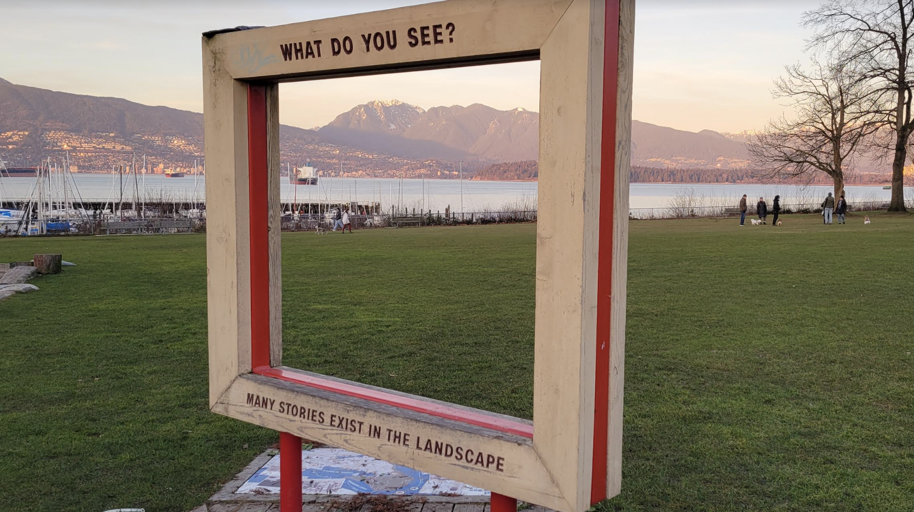

### disorientation
Learning through disorientation     
Coming from physical geography and geographic information science to human geography; 
Driving cross country here, without linear plan, no mental map of vancouver before arrival; 
TAing cartography - first lab assignment being to make a "map of vancouver" by tracing a screenshot from google maps in adobe illustrator

Tyranny of orientation: Flat maps, Google Maps, Geographic Information Science 
Spatial awareness developed through becoming lost and wandering around
    Detours, Topology (GIS and mental map) 
    Vignette: getting to wise 3 different ways, taking 33 bus 
The city is performatively constituted through navigations as a physical-conceptual field of encounter 

Research Creation --> Questions that set up a dialogue with the world  
What could it mean to `think *with* place, to *feel* the city`?

### Thinking through Practice 
I explore and respond to these questions through urban deep mapping, a practice of situated, embodied inhabitation by which I enter into dialogue with my surroundings 
Vignettes from practice are interspersed throughout the site. Constituting the empirics from fieldwork, I cite navigations and encounters from practice in the theory I convey here 

Deep mapping does not "counter cartography" - not defined by opposition so much as through iterative acts of interference with hegemonic, top-down forms of *ENGAGING & REPRESENTING PLACE, PRODUCING GEOGRAPHIC KNOWLEDGE, and RENDERING SPATIAL RESEARCH PUBLIC*. A mode of spatial analysis that accounts for rhythms that exceed measure, as they emerge in tension with time signatures; practical knowledge gleaned through practices of everyday life. layers that form depth of city inseparable - unlike discrete data layers loaded into GISystem for analysis, manipulation.     

DM attends to **spatial anthropology,** what Les Roberts (2018b, 30) calls an attempt to get at "the processes whereby the fundamental spatiality of being is woven into and from everyday practices, dispositions and experiential knowledge. To proceed on these terms ... is to understand and practice space as an existential ground of everyday being." 

"Place impels me; it is the actor. Place unfurls around me; it becomes the subject." Maleea Acker in Lyric Geography (2019, 132)

dialogue
Disorienting subject-object dualism, though **assuming field of encounter as interlocutor** -> human and non human, spatiality, navigations and encounters

Relationship Anarchy | Slow Scholarship | -> "Build for the lovely unexpected" - my orientation is that of slowing down, giving freely, and being open - open to spontaneity, serendipity, and the possibility of being transformed 
**agental realism** here? 
    deep mapping as praxis is an ethico-ontoepistemology––a way of being both of the world and an active participant in its continuous, intra-active transformation

#### New section? Frame, field, story? Framing the field? A field of frames
Accountability for positionality, exclusions, partiality of interpretation in conversation. 

Frame from the field: Many stories exist in the landscape, what do you see? (Loveless on research-creation, citing Haraway --> what stories are we grasped by, italo calvino's invisible cities) 

Situated Knowledges - Donna Haraway
        Geographic Information Science - STS 
        view from above - godtrick
        

Conveying partial conversation
    The following story is but one interpretation of my ongoing conversation with my city––a response woven with support from diverse literatures read through one another. Much of what I have gleaned remains (as yet) ineffable. And, that which I have theorized evolves from my own situated spatiotemporal practice. Therefore, I do not attempt to define deep mapping so much as possibilize a mode of doing theory grounded in practice. Sharing my story enacts deep mapping as praxis: challenging the boundaries of field and research, I valorize ways of being and operating in the world and academy that generatively interfere with hegemonic norms of intelligibility and legibility. 

Why do I locate my work in negative space, rendering negative-spaces.github.io -->  process, margins, refocusing from within the field, boundaries/limits  - constitutive exclusions, interlocutors -> 

### Interference
    Deep mapping not counter-cartography - not in opposition to cartography, GIS. Not outside field. Interfering generatively within. 

    Deep mapping is an orientation to geography research which recognizes, as Barad does, that “knowing, thinking, measuring, theorizing, and observing are material practices of intra-acting within and as part of the world” (Barad 2007, 90).

    Vignette: Bubble at wreck beach
        January 2022; First conception of deep mapping as (constructive) interference - stepping "into" the field as it were, diffracting, and interfering with superficial reflections (basemap) to produce a cartography beyond the monochrome 
    
    Situated knowledge --> commonalities and differences through dialogue, overlapping rhythms - constructive and destructive interference.

    Ideas, diffracting  - Frameworks, books, ways i read --> Frameworks, intertextuality
     
    Deep mapping as a 'diffractive apparatus' (Barad) - site and tactic for generating interference and studying how these patterns come to matter
    

### Negative Space
    Krauss, expanded field through problematizing oppositions
    Vignette: Avoid the subject sticker on lampost in gastown - February 2022 during rhythmanalysis (before i knew of the book) at intersection as part of counter-cartographies 
    Alleys, engage with Mat's piece
    Transgression (Foucault)
    eluding discipline from within the field (de certeau)

### Tactics
    GIS strategy(jon goss) vs Deep mapping tactics 
    Gleaning, Bricolage, Making do: What are tactics? My tactics?
        talk about my fieldwork! 
    Practical knowledge (James Scott on metis)
    ND - pattern recognition, Computational Thinking (GIS) 
    Analogue, methods, material practices of engaging texts

### Rhythmanalysis
    Rhythm exceeds measure
    Vignettes: monday night runners, reference back to bridge 
    Roberts - marooning - so cool!!!! 
    Bridge - feeling the city - bodily boundaries, de certeau on bridge
    time geography? - allen pred

### Rendering
    Research creation: the rhythm of deep mapping (thread reasearch creation throughout - articulating aspects of it as needed not dumping all at beginning before applicable (tactics))  
    lemniscate  - perspective, vanishing point !!!!!!!!
    form drawing: diffracting practices, situating practice
    Linearity, A-->B, flatness, pdf
    Projections, geoid, distortions, approximations
    - distortion of different attriubtes minimized FOR nav. PURPOSES etc. --> cartographers SELECT Projection

    Site form and formation - ATP - elaborate end of aag paper

### Superposition
    Theory as Praxis
    Theory and practice, toolbox (tactics) (Deleuze and Foucault)
    its all the field (ex. conference, symposium) 
    this site, its form and formation, site and tactic of dm, praxis
        cIRcle interference with system from within - restructuring, recoding
    ethico-ontoepistemology (barad) - inseparability of "self" from research practice, field - what this means - how i show up

    My interest is in the layered multiplicities not the single story. 
Less about reframing but widening the frame thinking about what is outside the frame, what is inside, the shape of the frame and why. 
Bella and I have this refrain: Its all the field. 

WHEN ITS ALL THE FIELD EVERYWHERE BECOMES A SITE FOR PRAXIS 

Praxis denotes the inseparability of theory and practice. 
### Toolkit 
    where i talk/show methods; workflows; devices and tools and materials that i use when where and how
### Field Notes
    running page of ideas etc. 
### Process Commonplace 
    pictures of notes, sketches, margins 