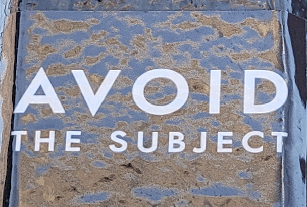

>disorientation encounter interference superposition  
foci loci topoi
field web site

>Vignettes from practice are interspersed throughout the site. Constituting the empirics from fieldwork, I cite navigations and encounters from practice in the theory I convey here. concepts like research-creation, disoriented discovery, negative space, interference & diffraction - evolve throughout pages and are invoked in different ways. 

Questions:  
where to put
NS - transgression, also boundaries, cuts, framings, choropleth maps and sts - gis and gaze from above 

>waves diffract upon **encountering** an other. superposition at the site of **interference**. co-producing a **pattern of difference** or a diffraction pattern. 

# disorientation
[writing space](disorientation.md)

**learning through disorientation**   
Coming from physical geography and geographic information science to human geography; 
Journey here - driving cross country without linear plan; no mental map of vancouver before arrival 
TAing cartography - making a "map of vancouver" by tracing a screenshot from google maps in adobe illustrator
**Tyranny of orientation**: Flat maps, Navigational Maps, and the fixation of trace causing a way of being in the world to be forgotten (Kurgan, de Certeau)

Spatial awareness developed not through following google's map from A --> B, but rather through becoming lost and wandering around. 

Thus disoriented, I find areas of familiarity connected in surprising ways. 

Vignette: getting to the WISE 3 different ways; taking the 33 bus as a detour

I realize the city is not a fixed and inherently bounded object which pre-exists my encounter and which I, the geographer-researcher, may separate myself from in order to map from a distanced, exterior position. Rather, the city is the physical-conceptual field of my encounter whose emergent topology is performatively constituted through everyday navigations. 

[Navigations, Exploration, and the performative iteration which articulates a field ](https://raw.githubusercontent.com/negative-spaces/negative-spaces.github.io/main/mindpalace/navigations.txt)

What if the field were not  a site separate from where spatial analyses are produced, maps rendered, and urban geography written? Bringing this orientation to the ground, as praxis, means **assuming the field of encounter (the city, as encountered if you will) as interlocutor**. 

I invoke **research-creation** to initiate such a dialogue with the world, asking
```
What could it mean to think *with* place, to *feel* the city?
```

- Kurgan, Laura. Close up at a Distance: Mapping, Technology, and Politics. First hardcover edition. Brooklyn, NY: Zone Books, 2013.
- Loveless, Natalie. How to Make Art at the End of the World: A Manifesto for Research-Creation. Duke University Press, 2019.
- Certeau, Michel de. The Practice of Everyday Life. Translated by Steven Rendall. Berkeley: University of California Press, 1984.


# Thinking through Practice 
[writing space](practice.md)

What if the field were not a site separate from where spatial analyses are produced, maps rendered, and urban geography written? Bringing this orientation to the ground, as praxis, means **assuming the field of encounter (the city, as encountered if you will) as interlocutor**. 

I invoke **research-creation** to initiate such a dialogue with the world, asking
```
What could it mean to think *with* place, to *feel* the city?
```

I explore and respond to these questions through urban **deep mapping, a practice of situated, embodied inhabitation by which I enter into dialogue with my surroundings** 

Deep mapping attends to **spatial anthropology,** what Les Roberts (2018b, 30) calls an attempt to name "the processes whereby the fundamental spatiality of being is woven into and from everyday practices, dispositions and experiential knowledge. To proceed on these terms ... is to understand and practice space as an existential ground of everyday being." 

Deep mapping does not render down to a map in the cartesian sense, where action is made legible by the substitution of trace for practice (de Certeau)
"very little of what deep mappers are doing is in fact oriented towards the production of maps so much as immersing themselves in the warp and weft of a lived and fundamentally intersubjective spatiality." (Roberts)


Deep mapping is research-creation for my process is driven by intellectual and spatial topoi which lure me forwards even before I comprehend where they lead (Loveless 2019, 95). 


## Process Oriented 
Process oriented, slow scholarship: Praxis based research.


    Exploration, put one way, is "the action of traveling in or through an unfamiliar area in order to learn about it" (https://bit.ly/3XeFxZw). Deep mapping is a practice of learning through disorientation. Though the field, geographical or conceptual, is at first unfamiliar, the iterative act of navigating, of finding ways around, coheres a framework of reference points which constitute whats known of the field. 
    
        "...navigation itself produces knowledge that feeds into its course and experience itself." (Tuin and Verhoeff 2022, 137-139)

Form drawing, multisensory learning, the act of doing - iteration. The lemniscate, infinity, limits. Focal points and the intersection of parallel lines with perspective in geometrical space. The right to the city. - no a or b beginning etc - would actually be good to put here
git repo - process - iterative 

takes time 


### Theorization from Practice
From my iteration through theory and practice by which I think together/with the physical-conceptual  fields of my encounter, I convey in this thesis an understanding of deep mapping that serves for now, for this project:

```
deep mapping is a praxis of interference with hegemonic forms of ENGAGING & REPRESENTING PLACE, PRODUCING GEOGRAPHIC KNOWLEDGE, and RENDERING SPATIAL RESEARCH PUBLIC
``` 

>"How we do, think about, think-with our research practices—be they written, spoken, or danced—matters." (Loveless 2019, 70)

That is what this project is about. -- not trace!!! not cartography in cartesian sense ---- not operationalize practice 

- McLucas, Clifford. “Deep Mapping.” Clifford McLucas. Accessed December 19, 2022. https://cliffordmclucas.info/deep-mapping.html.
- Modeen, Mary, and Iain Biggs. “Deep Mapping and Slow Residency.” In Creative Engagements with Ecologies of Place: Geopoetics, Deep Mapping and Slow Residencies, 50–73. London: Routledge, 2020. https://doi.org/10.4324/9781003089773.
- Bissell, Laura, and David Overend. “Regular Routes: Deep Mapping a Performative Counterpractice for the Daily Commute 1.” Humanities 4, no. 3 (September 2015): 476–99. https://doi.org/10.3390/h4030476.
- Biggs, Iain. “Deep Mapping as an ‘Essaying’ of Place,” 2010. http://www.iainbiggs.co.uk/text-deep-mapping-as-an-essaying-of-place/.
- ———. “Iain Biggs: Open Deep Mappings Today - a Personal Introduction.” ClimateCultures - Creative Conversations for the Anthropocene (blog). Accessed December 17, 2022. https://climatecultures.net/longer/open-deep-mappings/.
- Bull, Michael. “Sounding Out the City: An Auditory Epistemology of Urban Experience.” In The Auditory Culture Reader, 2nd ed. Routledge, 2015.
- Roberts, Les. “Deep Mapping and Spatial Anthropology.” Humanities 5, no. 1 (2016): 5. https://doi.org/10.3390/h5010005.
- ———. Spatial Anthropology: Excursions in Liminal Space. Rowman and Littlefield, 2018.
- Roberts, Les. “Spatial Bricolage: The Art of Poetically Making Do.” Humanities 7, no. 2 (June 2018): 43. https://doi.org/10.3390/h7020043.
- Loveless, Natalie. How to Make Art at the End of the World: A Manifesto for Research-Creation. Duke University Press, 2019.
- Certeau, Michel de. The Practice of Everyday Life. Translated by Steven Rendall. Berkeley: University of California Press, 1984.
- Candy, Linda. “Practice Based Research: A Guide,” 2006, 19.

# telling a story, framing the field 
[writing space](./stories.md)
*Expanded field, accountability for constitutive exclusions of frame*
*Fields I draw from, frameworks I overlay; The Field?, the Frame?; Research-Creation and Situated Knowledges; Agential Realism; Constitutive exclusions of framing, Accountability for negative spaces*

## Frameworks
>"Research-creation, in important ways, resists the illustrative frameworks in which a thesis or dissertation explains, justifies, or describes an artistic practice (and vice-versa), exploding the inherited binary between the artist-object and the theorist-subject..." (Loveless 2019, 44) 
>"research-creation suggests a mode of knowledge production that does more than simply contribute to existing realms of interdisciplinary and disciplinary data. Instead, without eschewing the asymmetries of hierarchical disciplinary differences, it tumbles outside of these intellectual frameworks, challenging practice/theory divides as they police what gets to count as a valid object and method, within which disciplinary framework, where, when, and how" (Lovless 2019, 70). 

My field cannot be instantaneously apprehended as the nominal City, nor can it be captured by the frame of a single map. Neither is one existing disciplinary framework or methodology sufficient: each time I leave home I bring along the people/stories/theories I wish to think with for the day. I put texts into conversation first amongst themselves. Heavy in my bag, their pages interlap, folding together like a pair of hands. Opening one, I open myself: README.md; Transform me. My field is the emergent web of connections drawing together (with) physical and conceptual topoi––a topology continuously transforming through intra-action. It is this relational entanglement that is at stake in rendering thinking through practice. 

## Framing 
cutting, frameing, creates negative space but definintion, bounding important sometimes (like to write a thesis) so i try my best to be accountabiley for constitutive exclusions 

**agental realism** when do i get into this??

“knowing, thinking, measuring, theorizing, and observing are material practices of intra-acting within and as part of the world” (Barad 2007, 90).

Deep mapping is a way of living spatially - being both of the world and accountable for 'intra-acting within and as part of the world in its differential becoming' (barad  2007)


*Many stories exist in the landscape. What do you see?*


Situated Knowledges - Donna Haraway - accountability for positionality, perspective, location, situatedness, partial view.  
**assuming field of encounter as interlocutor** disorients subject-object dualism - agential realism 

Intertextuality 

Conveying **partial** side of conversation, an interpretation. I do not claim to speak for the field nor from the perspective of anyone but myself.

    The following story is but one interpretation of my ongoing conversation with my city––a response woven with support from diverse literatures read through one another. Much of what I have gleaned remains (as yet) ineffable. And, that which I have theorized evolves from my own situated spatiotemporal practice. Therefore, I do not attempt to define deep mapping so much as possibilize a mode of doing theory grounded in practice. Sharing my story enacts deep mapping as praxis: challenging the boundaries of field and research, I valorize ways of being and operating in the world and academy that generatively interfere with hegemonic norms of intelligibility and legibility. 

 
research-creation: "insisting we attend to those drives and desires that animate our stories—the stories that we find ourselves told by—and the ethics embedded in such modes of attention. The stories at stake here are not conscious. These aren’t simply stories that we mobilize, that we control. These are stories that grasp us as much if not more than we grasp them." (Loveless 2019, 95)

For me these stories are Invisible Cities by Italo Calvino and Rhythmanalysis by Henri Lefebvre. "...to grasp a rhythm it is necessary to have been grasped by it; one must let oneself go, give oneself over, abandon oneself to its duration. (Lefebvre. 27) --> Bridge --> good description of boundary practices of frames, why necessary, how made and remade through intra action 

- Law, John. “Multiple Worlds.” In After Method. Routledge, 2004.
- Loveless, Natalie. How to Make Art at the End of the World: A Manifesto for Research-Creation. Duke University Press, 2019.
- ———, ed. Knowings and Knots. The University of Alberta Press, 2019.
- Leeuw, Sarah de, and Harriet Hawkins. “Critical Geographies and Geography’s Creative Re/ Turn: Poetics and Practices for New Disciplinary Spaces.” Gender, Place & Culture 24, no. 3 (2017): 303–24.
- Hawkins, Harriet, Lou Cabeen, Felicity Callard, Noel Castree, Stephen Daniels, Dydia DeLyser, Hugh Munro Neely, and Peta Mitchell. “What Might GeoHumanities Do? Possibilities, Practices, Publics, and Politics.” GeoHumanities 1, no. 2 (July 3, 2015): 211–32. https://doi.org/10.1080/2373566X.2015.1108992.
- Candy, Linda. “Practice Based Research: A Guide,” 2006, 19.
- Mountz, Alison, Anne Bonds, Becky Mansfield, Jenna Loyd, Jennifer Hyndman, Margaret Walton-Roberts, Ranu Basu, et al. “For Slow Scholarship: A Feminist Politics of Resistance through Collective Action in the Neoliberal University.” ACME: An International Journal for Critical Geographies 14, no. 4 (August 18, 2015): 1235–59.
- 


# Negative Space - story part? 
Krauss, expanded field through problematizing oppositions (sculpture as not-landscape and not-architecture)

Vignette: 
    Avoid the subject sticker on lampost in gastown - February 2022 during rhythmanalysis (before i knew of the book) at intersection as part of counter-cartographies 

</img>

Framing - field - create ns. problematise, but also when /where/why important to bound

In visual art, negative space is that which surrounds the subject but is not the intended focus of attention. Indeed, the intelligible form is defined by what it others––what it excludes, what it is not. 

Why do I locate my work in negative space, rendering negative-spaces.github.io -->  process, margins, refocusing from within the field, boundaries/limits  - constitutive exclusions, interlocutors -> 

Alleys, engage with [Mat's piece](https://culanth.org/fieldsights/series/four-alleys)
Alley Walks (od checks)

expanding field (what counts as valid research method, output, subject) by refocusing to negative spaces. 
ns not one space, shifting, what is out of focus. funnny bc i have exceptional eyesight and have difficulty differentiating forground and backgorund. so, actually, bounding is very important for me in this thesis bc otherwise i will include every single thing i think of thats relevent. 


# Interference
[writing space](./interference.md)
Deep mapping does not "counter cartography" - not defined by opposition so much as through iterative acts of interference with hegemonic, top-down forms of ENGAGING & REPRESENTING PLACE, PRODUCING GEOGRAPHIC KNOWLEDGE, and RENDERING SPATIAL RESEARCH PUBLIC.  
Not outside the field but interfering generatively from within (negative space). 


Vignette: Bubble at wreck beach
    
<video src="../media/field/thinfilm-interference.mp4" controls="autoplay" style="width: 50%;"></video>

January 2022; First conception of deep mapping as (constructive) interference - stepping "into" the field as it were, diffracting, and interfering with superficial reflections (basemap) to produce a cartography beyond the monochrome 

    "Diffraction does not produce "the same" displaced, as reflection and refraction do. Diffraction is a mapping of interference, not of replica­ tion, reflection, or reproduction. A diffraction pattern does not map where differences appear, but rather maps where the effects of difference appear. "  ‘Promises of Monsters’ p 70

    "Diffraction patterns record the history of interaction, interference, reinforcement, difference. Diffraction is about heterogeneous history, not about originals. Unlike reflections, diffractions do not displace the same elsewhere, in more or less distorted form, thereby giving rise to industries of metaphysics. Rather, diffraction can be a metaphor for another kind of critical consciousness at the end of this rather painful Christian millennium, one committed to making a difference and not to repeating the Sacred Image of Same. Diffraction is askew of Christian narrative and Platonist optics, in their sacred secular technoscientific story cycles as well as their more orthodox manifestations. Diffraction is a narrative, graphic, psychological, spiritual, and political technology for making consequential meanings." (Haraway 2018, 273)

Ideas, diffracting upon encountering Barad a year later --> understanding deep mapping as interference in general, both destructive and constructive 


DIFFRACTION IS ACCOUNTING FOR HOW PRACTICES MATTER 
(thinking through practice is diffracting theory through practice, praxis. also whole life learnings)

 ***Deep mapping :: research-creation ::  interference :: diffraction :: transformation through encounter, two waves (rhythms) are spatiotemporally aligned and in so being alter and are altered by one another producing a new wave (subject/object, researcher/field, Lily/City)***

Situated knowledge --> commonalities and differences through dialogue, in other words, a diffraction pattern

>"apparatuses are material-discursive practices-causal intra-actions through which matter is iteratively and diferentially articu­lated, reconfigurinn the material-discursive field of possibilities and impossibilities in the ongoing dynamics of intra-activity that is agency. Apparatuses are not bounded objects or structures; they are open-ended practices." (Barad 2007, 170)

```
Deep mapping as a Baradian diffractive apparatus for generating interferences and studying how they (these patterns of difference) come to matter
```

thinking through practice -- is diffraction 

barad - all field - possibilities - haraway - nodes 

Sensorium is the initial mechanism by which I receive data from my surroundings. I walk the shoreline to feel something visceral. "Deep mapping... presupposed the embodied presence of the researcher 'within' the space under investigation." (Roberts 2018, 11). s/c/iting the body as reference. 

> (Barad 2007, 185): 
"There is an important sense in which practices of knowing cannot fully be claimed as human practices, not simply because we use nonhuman elements in our practices but because knowing is a matter of part of the world making itself intelligible to another part. Practices of knowing and being are not isolable; they are mutually implicated. We don't obtain knowledge by standing outside the world; we know because we are of the world. We are part of the world in its differential becoming. The separation of epistemology from ontology is a reverberation of a metaphysics that assumes an inherent difference between human and nonhuman, subject and object, mind and body, matter and discourse. Onto-epistem-ology-the study of practices of knowing in being-is probably a better way to think about the kind of understandings that we need to come to terms with how specific intra­ actions matter. Or, for that matter, what we need is something like an ethico­ onto-epistem-ology-an appreciation of the intertwining of ethics, knowing, and being-since each intra-action matters, since the possibilities for what the world may become call out in the pause that precedes each breath before a moment comes into being and the world is remade again, because the becoming of the world is a deeply ethical matter." 


# Negative Spaces - boundary play and transgression part

NS - transgression, also boundaries, cuts, framings, choropleth maps and sts - gis and gaze from above 
limits, infinity, perspective, vanishing points. spiral. 

>(de Certeau 1984, 96): "multiform, resistance, tricky and stubborn procedures that elude discipline without being outside the field in which it is exercised, and which should lead us to a theory of everyday practices, of lived space, of the disquieting familiarity
of the city."

Negative Space --> Deep mapping as transgression (foucault, creswell, roberts, biggs) and eluding discipline from within the field (de certeau) 

    Foucault: preface to transgression (1977)
    "The limit and transgression depend on each other for whatever density of being they possess: a limit could not exist if it were absolutely uncrossable and, reciprocally, transgression would be pointless if it merely crossed a limit composed of illu­sions and shadows... Trans­gression caries the limit right to the limit of its being; transgres­ sion forces the limit to face the fact of its imminent disappearance, to find itself in what it excludes" (34)

    "Transgression, then, is not related to the limit as black to white, the prohibited to the lawful, the outside to the inside, or as the open area of a building to its enclosed spaces. Rather, their relationship takes the form of a spiral which no simple infraction can exhaust. Perhaps it is like a flash of lightning in the night which, from the beginning of time, gives a dense and black in­ tensity to the night it denies, which lights up the night from the inside, from top to bottom, and yet owes to the dark the rtark clarity of its manifestation, its harrowing and poised singularity; the flash loses itself in this space it marks with its sovereignty and becomes silent now that it has given a name to obscurity." (35)

    "its [transgression's] role is to measure the excessive distance that it opens at the heart of the limit and to trace the flashing line that causes the limit to arise. Transgression contains nothing negative, but affirms limited being—affirms the limitlessness into which it leaps as it opens this zone to existence for the first time" (35)

    DM is counter conduct not counter cartography 
    "inventively modify, resist or escape the ways in which we are governed" (http://sro.sussex.ac.uk/id/eprint/59644/1/Counter-conduct%20Special%20Issue%20introduction%20Final-1.pdf)

    Bataille: "to revolt is to be there, sovereign and without limits" 


# Tactics of deep mapping
[writing space](./tactics.md)

## strategy  vs tactics
- Tactics are methods whose validity is measured by their applicability to the situation at hand (de Certeau 1984)
- GIS deploys strategy (cf jon goss) while deep mapping employs tactics 
could this be the space for gis, godtrick, gaze from above, sts? 
- could describe doing gis and cartography then deep mapping, different skills (computational skills, bricolage) translating - troubleshooting as pattern recognition - whoa maybe yeah 

## Bricolage, Making Do, Gleaning**
>"Whatever is found in whatever landscape the gleaner-bricoleur happens to find herself at whatever time she happens to be there is potentially constituent matter of an assemblage-in-progress, the production of which may take a number of different forms (or none at all - the practice of gleaning-bricolage need not cede an 'output' for it to still count as gleaning and/or bricolage)." Les Roberts (2018), in *Spatial Bricolage: The Art of Poetically Making Do* 

early cartographic bricolage - in pickles genealogy of modern mapping pg 88

- "**gleaning** as spatial praxis" : gleaning in alleys, finding lighters, an outlet, a shirt, some shoes just when im needing it
- Engage [Matt's piece “Four Alleys”](https://culanth.org/fieldsights/series/four-alleys)
- gleaning information all around - collecting signs and symbols for future reference, whenever needed - or, to make connections, patterns

## Practical knowledge** 
Appropriate use of tactics depends on practical, experiential knowledge gleaned through everyday navigations of terrains physical, conceptual, and digital 
James Scott on Mētis, practical knowledge --> all about computational thinking, gleaning, tactics of making do and bricolage
- experiential learning, learning as/thru doing (CCCH)
- pattern recognition, hand-eye coordination, adjusting as needed (unicycling, juggling)
- "The practice and experience reflected in metis is almost always **local**." (Scott, 317) --> gap b/w general knowledge and situated knowledge - whats lost in jumping scales- like tracing a screenshot of aerial google maps vancouver to get a sense of the city vs inhabiting it for a while
 
## Theory: a tactical toolkit
"the researcher-as-bricoleur goes about his or her business equipped with a set of tools rather than a fit-for-purpose methodological strategy" (Roberts 2018, 54)

>Foucault: "... In this sense **theory does not express, translate, or serve to apply practice: it is practice.** But it is local and regional, as you said, and not totalising. This is a struggle against power, a struggle aimed at revealing and undermining power where it is most invisible and insidious. It is not to "awaken consciousness" that we struggle (the masses have been aware for some time that consciousness is a form of knowledge; and consciousness as the basis of subjectivity is a prerogative of the bourgeoisie), but to sap power, to take power; it is an activity conducted alongside those who struggle for power, and not their illumination from a safe distance. A "theory " is the regional system of this struggle."
Deleuze "Precisely. **A theory is exactly like a box of tools. It has nothing to do with the signifier. It must be useful. It must function. And not for itself. If no one uses it, beginning with the theoretician himself (who then ceases to be a theoretician), then the theory is worthless or the moment is inappropriate....** A theory does not totalise; it is an instrument for multiplication and it also multiplies itself." (Foucault 1977, Intellectuals and power)

Proper deployment of theory - a tactic
methods - a tactic
deep mapping must be practiced. It does not exist as a theory. only praxis. 
my thesis here not only conveys a theory of a practice generated through the practice but enacts the practice... see rendering portion 
     
## My toolskit
Analogue, methods, material practices of engaging texts
where i explain/demonstrate eclectic methods; skills, tools, and materials i employ (as appropriate) in my research-creation process
why analogue at times - when do i employ the digital and for what ends? all part of apparatus

- Narayan, Priti, and Emily Rosenman. “From Crisis to the Everyday: Shouldn’t We All Be Writing Economies?” Environment and Planning A: Economy and Space 54, no. 2 (March 1, 2022): 392–404. https://doi.org/10.1177/0308518X211068048.
- Crouch, David. “Bricolage, Poetics, Spacing.” Humanities 6, no. 4 (December 2017): 95. https://doi.org/10.3390/h6040095.
- Scott, James. “Thin Simplificationsand Practical Knowledge: Mētis.” In Seeing Like a State, 309–41. Yale University Press, 1998.
- Routledge & CRC Press. “A History of Spaces: Cartographic Reason, Mapping and the Geo-Coded World.” Accessed May 4, 2023. https://www.routledge.com/A-History-of-Spaces-Cartographic-Reason-Mapping-and-the-Geo-Coded-World/Pickles/p/book/9780415144988.
- Routledge & CRC Press. “Ground Truth: The Social Implications of Geographic Information Systems.” Accessed May 4, 2023. https://www.routledge.com/Ground-Truth-The-Social-Implications-of-Geographic-Information-Systems/Pickles/p/book/9780898622959.


# Rhythmanalysis
    Rhythm exceeds measure 
    Vignettes: monday night runners, reference back to bridge 
    Roberts - marooning - so cool!!!! 
    Bridge - feeling the city - bodily boundaries, de certeau on bridge
    time geography? - allen pred


"...to grasp a rhythm it is necessary to have been grasped by it; one must let oneself go, give oneself over, abandon oneself to its duration" (Lefebvre, 27).
    "His eleveation transfigures him into a voyeur... It puts him at a distance. It ransforms the bewitching world by which one was "posessed" into a text that lies before one's eyes. It allows one to read it, to be a solar Eye, looking down like a god. The exaltation of a scopic and gnostic drive: the fiction of knowledge is related to this lust to be a viewpoint and nothing more." (92)

    Like in music and the learning of a language (in which one only really understands the meanings and connections when one comes to produce them, which is to say, to produce spoken rhythms)."

# Rendering
    Research creation: the rhythm of deep mapping (thread reasearch creation throughout - articulating aspects of it as needed not dumping all at beginning before applicable (tactics))  
    lemniscate  - perspective, vanishing point !!!!!!!!
    form drawing: diffracting practices, situating practice

    STS here? gaze, GIS, rendering down from above
    "His eleveation transfigures him into a voyeur... It puts him at a distance. It ransforms the bewitching world by which one was "posessed" into a text that lies before one's eyes. It allows one to read it, to be a solar Eye, looking down like a god. The exaltation of a scopic and gnostic drive: the fiction of knowledge is related to this lust to be a viewpoint and nothing more." (92)

                ..."Escaping the imaginary totalizations produced by the eye, the everyday has a certain strangeness that does not surface, or whose surface is only the upper limit, outlining itself against the visible." (93)

"Deep mapping... presupposed the embodied presence of the researcher 'within' the space under investigation." (Roberts 2018, 11).
    Linearity, A-->B, flatness, pdf
    Projections, geoid, distortions, approximations
    - distortion of different attriubtes minimized FOR nav. PURPOSES etc. --> cartographers SELECT Projection


"Indeed, this "representation" is insufficient, precisely because a trajectory is drawn, and time and movement are thus reduced to a line that can be seized as a whole by the eye and read in a single moment, as one projects onto a map the path taken by someone walking through a city. However useful this "flattening out" may be, it transforms the temporal articulation of places into a spatial sequence of points. A graph takes the place of an operation. A reversible sign (one that can be read in both directions, once it is projected onto a map) is substituted for a practice indissociable from particular moments and "opportunities," and thus irreversible (one cannot go backward in time, or have another chance at missed oppor­ tunities). It is thus a mark in place of acts, a relic in place of perfor­ mances: it is only their remainder, the sign of their erasure. Such a projection postulates that it is possible to take the one (the mark) for the other (operations articulated on occasions)" (de certeau 35).
    Site form and formation - ATP - elaborate end of aag paper

"Research-creation follows desire, and builds spaces and contexts that allow the time and space
        to experiment in unpredictable directions. " (Loveless 2019, 70)

        Research-creation outputs as 'boundary objects' (Bowker and Star 1999)
            "A boundary object does things with disciplines, satisfying certain of their requirements, without, however, belonging properly to any one of them" (32)


# Superposition
>"Research-creation, in important ways, resists the illustrative frameworks in which a thesis or dissertation explains, justifies, or describes an artistic practice (and vice-versa), exploding the inherited binary between the artist-object and the theorist-subject..." (Loveless 2019, 44) Form! Matters!
>"research-creation suggests a mode of knowledge production that does more than simply contribute to existing realms of interdisciplinary and disciplinary data. Instead, without eschewing the asymmetries of hierarchical disciplinary differences, it tumbles outside of these intellectual frameworks, challenging practice/theory divides as they police what gets to count as a valid object and method, within which disciplinary framework, where, when, and how" (Lovless 2019, 70). 

>“GeoHumanities… do not just require us to move beyond disciplinary silos; they also unsettle relations among theory, praxis, scholarship, practice, and application and undo the privilege of academic expertise. …radical because what is developed in the course of such work is not just new knowledge, but a set of reflections that take aim at the practices and processes of knowledge production themselves” (Hawkins et al)

I am (we are all) both wave and particle. Although routinely apprehended as individuals, fixed, bounded, defined bodies, we are permeable - continuously transfiguring through encounters, experiencing life as a process transforming and transfiguring through intra-action. We emanate waves which interfere and are interfered with by others, human and nonhuman. To practice deep mapping is to embody superposition: (theorypractice, spacetime, waveparticle, subjectobject, thinkingbeing, ontoepistemology, insideoutside,  .... ). Paradox is not a closure but an opening - to possibilities - the existance of multiple states, simultaneous multiplicities, inextricable layers.  

Theory as praxis 

Deep mapping as I have come to theorize (with) it does not ‘counter cartography;’ it is not defined by opposition so much as through iterative acts of interference with hegemonic forms of engaging/representing place, producing geographic knowledge, and rendering spatial research public. Understood this way, deep mapping is a Baradian diffractive apparatus for making interferences and studying how they come to matter. 


deep mapping - both site and tactic 
praxis is diffractice -- thinking through practice, also enacting, generating interferences, 

    Theory and practice, toolbox (tactics) (Deleuze and Foucault)
    Praxis denotes the inseparability of theory and practice. 
    Theory as Praxis
    
    its all the field (ex. conference, symposium) 
    this site, its form and formation, site and tactic of dm, praxis
        cIRcle interference with system from within - restructuring, recoding
    ethico-ontoepistemology (barad) - inseparability of "self" from research practice, field - what this means - how i show up

    My interest is in the layered multiplicities not the single story. 
Less about reframing but widening the frame thinking about what is outside the frame, what is inside, the shape of the frame and why. 
Bella and I have this refrain: Its all the field. 

WHEN ITS ALL THE FIELD EVERYWHERE BECOMES A SITE FOR PRAXIS 


# Field Notes
ongoing corkboard of ideas/scraps from field - transposition from initial medium to the digital is quite backlogged:/ 
[see-here](../field-notes.html)

# Process Commonplace 
[see-here](../commonplace.html)
    "Although understanding is spatial in organization, it is not necessarily visual or tactile. All grasp of musical ideas, for example, involves perception of a gestalt.
    
    One might say: ontological understanding is rooted in the 
    perception of patterned resonance in the world.

    Philosophy, practised as a setting of things side by side until the 
    similarity dawns, is a form of ontological appreciation"

    (7 left) <-- citation i left for myself; remembered this must be from Jan Zwicky's Wisdom and Metaphor, a commonplace book. 

    This page collages pictures of notes, sketches, ideas in marginalia, gleanings, spatial workflows (git, transcription and translation of voice recordings);
    

# Dedication & Acknowledgement 